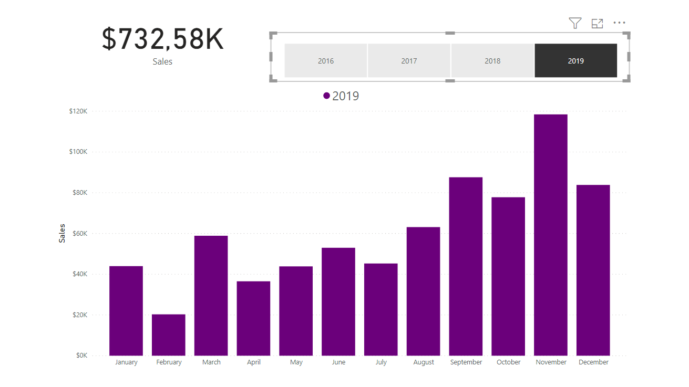

# BarChart Power BI

I tried solving the challenge from [2020 Week 23: Can you excel at bar charts?](http://www.workout-wednesday.com/2020w23/) that also had a [dataset](https://data.world/annjackson/20194-tableau-superstore) needed for it to be solved.

The challenge was relatively straight-foward, I needed to remake a bar chart to look like a Microsoft Excel bar chart. 

Overall it wasn't hard to do the challenge and it was a good way for me to begin working in Power BI.

The end result was:

## Bar chart - general result

## Bar chart result for 2019

